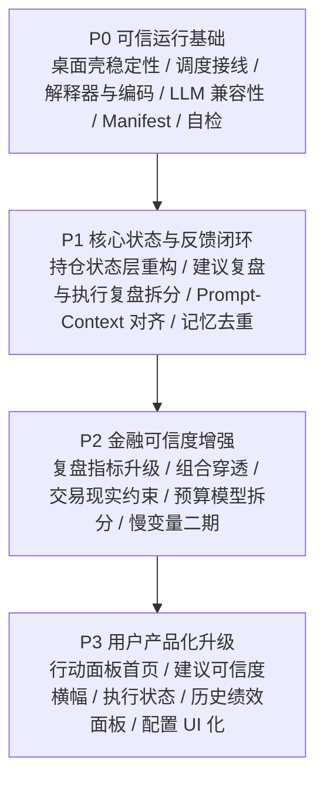

# okra assistant 改造执行路线图

- 文档定位：把当前已识别的关键问题转成后续可持续执行的修复路线
- 适用范围：`F:\okra_assistant`
- 更新日期：2026-03-13
- 使用方式：后续每次继续修复前，优先按本文件确认当前阶段、依赖关系与验收标准

---

## 1. 目标

本轮路线图的目标不是继续无节制扩功能，而是把 `okra assistant` 从“已经能用的个人基金研究系统”进一步升级为：

1. 运行更稳定的本地投资助手
2. 金融评价口径更可信的组合助手
3. 对个人用户更清晰、更可执行的日常工作台
4. 后续可以连续迭代、不会越修越乱的工程项目

---

## 2. 总体原则

1. **先修可信运行，再扩金融能力，最后强化产品表达**
2. **先补会直接导致误判、崩溃、运行失败的问题**
3. **先区分“建议层正确性”和“用户执行层正确性”**
4. **所有改造都必须有明确交付物、依赖、验收标准**
5. **保留可追溯性，不为追求整洁而丢失关键历史产物**

---

## 3. 总体路线图

---

## 4. 优先级矩阵

| 阶段 | 主题 | 核心目标 | 为什么排在这里 |
| --- | --- | --- | --- |
| P0 | 可信运行基础 | 先保证系统不崩、能跑、能解释失败 | 当前已有真实运行失败、桌面崩溃、配置与调度未对齐问题 |
| P1 | 核心状态与反馈闭环 | 让组合状态、复盘对象、prompt 输入边界更准确 | 不先修这一层，后续金融分析和 UI 都会建立在不稳定状态之上 |
| P2 | 金融可信度增强 | 让系统更接近真实基金投资执行和评估口径 | 这是从“研究工具”升级成“可信组合助手”的关键 |
| P3 | 用户产品化升级 | 让用户更容易理解、执行、复盘、持续使用 | 在基础可信度稳定后再强化体验，性价比最高 |

## 4.1 当前进度

| 日期 | 阶段 | 状态 | 说明 |
| --- | --- | --- | --- |
| 2026-03-13 | P0 | 已完成 | 已落地：失败 agent UI 修复、调度窗口接线、解释器自动发现、preflight、自增量 manifest、LLM 兼容性与降级可视化 |
| 2026-03-13 | P1 | 已完成 | 已落地：状态层拆分、建议复盘/执行复盘双链路、prompt/context 契约文档、memory 去重与偏置过期 |
| 2026-03-13 | P2 | 已完成 | 已落地：复盘指标升级、组合穿透增强、交易现实约束二期、双预算模型、慢变量二期基础画像 |
| 2026-03-13 | P3 | 已完成 | 已落地：行动面板首页、可信度横幅、执行状态流转、历史绩效摘要、关键配置 UI 化第一版 |

---

## 5. P0：可信运行基础

### P0-1. 修复桌面壳在失败智能体场景下的崩溃

- 当前状态：`[done]`（2026-03-13）
- 优先级：`P0-最高`
- 当前问题：
  - 当 `aggregate.failed_agents` 中存在失败项时，Dashboard 在拼接“失败智能体”字符串时按 `str list` 处理，真实数据却是 `dict list`
  - 这会导致桌面壳在启动或刷新首页时直接抛异常，用户反而看不到失败详情
- 必做内容：
  - 修复 Dashboard 的失败智能体渲染逻辑
  - 统一 `failed_agents` 在 UI 层的展示格式
  - 区分“agent 失败但系统可降级继续用”和“整条链路不可用”两类提示
  - 保证首页、智能体页、告警层都能看到失败角色和失败原因
- 涉及文件：
  - `F:\okra_assistant\app\ui_support.py`
  - `F:\okra_assistant\app\desktop_shell.py`
  - `F:\okra_assistant\app\task_state.py`
- 交付物：
  - Dashboard 不再因失败 agent 崩溃
  - 首页告警显示失败角色名和失败摘要
  - 失败时仍能进入 Agents Room 查看细节
- 验收：
  - 构造一个 `failed_agents=[{"agent_name":"x","error":"..."}]` 的状态样本，桌面壳可正常加载
  - 首页显示“存在失败”而不是崩溃退出

### P0-2. 收敛调度配置与实际运行逻辑

- 当前状态：`[done]`（2026-03-13）
- 优先级：`P0-最高`
- 当前问题：
  - `strategy.toml` 中的 `intraday_end`、`nightly_end`、`run_if_missed_on_next_boot`、`report_mode` 等调度配置没有完整接线
  - 用户会误以为配置已生效，但运行脚本实际上只使用了开始时间
- 必做内容：
  - 让 `run_report_window.py` 真正读取并执行完整时间窗口逻辑
  - 明确“开始前不跑、窗口内可跑、窗口后是否补跑”的行为
  - 把 `run_if_missed_on_next_boot` 接入桌面壳和计划任务恢复逻辑
  - 明确 `report_mode` 是否仍需要；若需要则正式接线，否则删除
  - 给用户显示“当前调度配置是否已接线”的状态
- 涉及文件：
  - `F:\okra_assistant\config\strategy.toml`
  - `F:\okra_assistant\scripts\run_report_window.py`
  - `F:\okra_assistant\app\ui_support.py`
  - `F:\okra_assistant\app\desktop_shell.py`
- 交付物：
  - 完整的调度窗口执行规则
  - 配置项使用清单
  - UI 中的调度状态说明
- 验收：
  - 提前、窗口内、错过窗口后三种场景均能得到符合配置的结果
  - 不再存在“配置写了但代码没真正使用”的窗口调度项

### P0-3. 去除硬编码解释器与统一日志/编码策略

- 当前状态：`[done]`（2026-03-13）
- 优先级：`P0-高`
- 当前问题：
  - 启动脚本硬编码 `D:\python\python.exe`
  - 任务日志存在乱码/编码不一致
  - 部分旧日志明显带 UTF-16 或历史路径残留
- 必做内容：
  - 改造 PowerShell 启动脚本，支持：
    - 优先使用配置中的 Python 路径
    - 若未配置，则尝试 `py` 或当前环境 `python`
    - 启动前检查解释器是否存在
  - 统一桌面、任务、脚本日志编码为 UTF-8
  - 修复计划任务与 PowerShell 重定向导致的乱码问题
  - 增加“日志编码与路径健康检查”
- 涉及文件：
  - `F:\okra_assistant\run_daily_report.ps1`
  - `F:\okra_assistant\run_nightly_review.ps1`
  - `F:\okra_assistant\run_desktop_app.ps1`
  - `F:\okra_assistant\scripts\run_report_window.py`
  - `F:\okra_assistant\app\ui_support.py`
- 交付物：
  - 可移植的启动脚本
  - UTF-8 一致化日志策略
  - 解释器自检错误提示
- 验收：
  - 修改 Python 安装位置后仍可通过配置或自动发现启动
  - 新生成任务日志不再出现乱码

### P0-4. 治理 LLM 兼容性、传输稳定性与失败降级

- 当前状态：`[done]`（2026-03-13）
- 优先级：`P0-最高`
- 当前问题：
  - 真实运行里出现模型不兼容、`IncompleteRead`、`SSLEOF`、`response.failed`
  - 多次 intraday manifest 失败，且用户会在桌面层直接感知为“系统没给结果”
- 必做内容：
  - 在运行前检查：
    - 当前 provider 是否支持 `config/llm.toml` 中的模型
    - 当前认证方式是否兼容该模型
  - 增加模型兼容性白名单或 provider 能力探测
  - 细化 direct / env_proxy 的失败统计与选择逻辑
  - 为多智能体和 final summarizer 分开维护失败统计与重试策略
  - 明确何时走 `committee_fallback`，何时终止运行
  - 在 UI 中显式显示本次是否为 fallback 结果
  - 给失败产物补统一的故障摘要，而不是让用户只看到 subprocess error
- 涉及文件：
  - `F:\okra_assistant\config\llm.toml`
  - `F:\okra_assistant\scripts\multiagent_utils.py`
  - `F:\okra_assistant\scripts\run_multiagent_research.py`
  - `F:\okra_assistant\scripts\generate_llm_advice.py`
  - `F:\okra_assistant\app\ui_support.py`
  - `F:\okra_assistant\app\desktop_shell.py`
- 交付物：
  - 模型兼容性检查
  - 更稳定的 SSE/重试/降级策略
  - fallback 可见化
  - 更可读的运行失败摘要
- 验收：
  - 模型不兼容时，系统能在运行前明确报错，而不是跑到中途才失败
  - LLM 失败时 UI 能告诉用户“本次为 fallback”或“本次无有效建议”

### P0-5. 把 Manifest 改成边跑边写的运行账本

- 当前状态：`[done]`（2026-03-13）
- 优先级：`P0-高`
- 当前问题：
  - 当前 manifest 主要在整段结束后落盘
  - 一旦中途失败，经常只有总耗时和错误，缺少已完成步骤、耗时、最后成功点位
- 必做内容：
  - 在每个步骤开始和结束时更新 manifest
  - 落盘：
    - 当前步骤
    - 已完成步骤
    - 失败步骤
    - transport
    - fallback 状态
    - failed agents
  - 让桌面壳直接读取最新 manifest，而不是只靠 stdout 文本推断
- 涉及文件：
  - `F:\okra_assistant\scripts\run_manifest_utils.py`
  - `F:\okra_assistant\scripts\run_daily_pipeline.py`
  - `F:\okra_assistant\scripts\run_realtime_monitor.py`
  - `F:\okra_assistant\app\task_state.py`
  - `F:\okra_assistant\app\desktop_shell.py`
- 交付物：
  - 增量 manifest
  - 更稳定的任务状态卡片
  - 更可读的失败回溯信息
- 验收：
  - 任一中途失败时，都能从 manifest 看到最后完成到哪一步

### P0-6. 增加启动前自检与健康检查

- 当前状态：`[done]`（2026-03-13）
- 优先级：`P0-高`
- 当前问题：
  - 用户当前只能在运行失败后再去查日志
  - 本地项目对 Python、路径、provider、API key、目录权限、关键配置完整性依赖较多
- 必做内容：
  - 增加 preflight 检查命令或公共模块
  - 至少检查：
    - Python 解释器
    - API key
    - provider 关键配置
    - 关键目录是否存在且可写
    - 组合文件/观察池是否可读
    - 调度配置是否合法
    - 模型/provider 是否兼容
  - 在桌面 Settings 页展示健康状态
- 涉及文件：
  - `F:\okra_assistant\scripts\common.py`
  - `F:\okra_assistant\app\ui_support.py`
  - `F:\okra_assistant\app\desktop_shell.py`
  - 可新增 `F:\okra_assistant\scripts\preflight_check.py`
- 交付物：
  - 启动前自检
  - UI 健康检查面板
- 验收：
  - 常见环境错误能在运行前被识别并提示

---

## 6. P1：核心状态与反馈闭环

### P1-1. 把 `portfolio.json` 从“单一配置文件”升级为“组合定义 + 流水 + 快照”

- 当前状态：`[done]`（2026-03-13）
- 优先级：`P1-最高`
- 当前问题：
  - 交易回写和官方净值重估都直接修改 `config/portfolio.json`
  - 长期会让“初始定义、当前状态、历史快照、每日估值”混在一个文件里
- 必做内容：
  - 拆分为：
    - 组合定义层
    - 交易流水层
    - 每日估值快照层
    - 当前聚合视图层
  - 明确哪些字段是用户维护，哪些字段是系统派生
  - 让重估与交易回写优先更新派生状态，而不是直接覆盖原始定义
  - 支持从流水和快照重建当前持仓状态
- 涉及文件：
  - `F:\okra_assistant\config\portfolio.json`
  - `F:\okra_assistant\scripts\update_portfolio_from_trade.py`
  - `F:\okra_assistant\scripts\record_trade.py`
  - `F:\okra_assistant\scripts\revalue_portfolio_official_nav.py`
  - `F:\okra_assistant\scripts\build_realtime_profit.py`
- 交付物：
  - 状态层重构方案
  - 可重建的组合状态
  - 更清晰的数据边界
- 验收：
  - 任意一天的组合状态都能从定义 + 流水 + 快照恢复

### P1-2. 把“建议复盘”和“实际执行复盘”拆成两条正式链路

- 当前状态：`[done]`（2026-03-13）
- 优先级：`P1-最高`
- 当前问题：
  - 现在复盘基于 `validated_advice`
  - 这能评估系统建议质量，但不能评估用户真实执行结果
- 必做内容：
  - 明确两套复盘口径：
    - 建议层复盘：评估模型与规则层输出本身
    - 执行层复盘：评估用户真实成交后的组合结果
  - 交易日志中增加建议关联、执行状态、成交确认信息
  - review report 与 memory 更新时区分两套来源
  - UI 中清楚标注当前查看的是哪一种复盘
- 涉及文件：
  - `F:\okra_assistant\config\review.toml`
  - `F:\okra_assistant\scripts\review_advice.py`
  - `F:\okra_assistant\scripts\update_review_memory.py`
  - `F:\okra_assistant\scripts\record_trade.py`
  - `F:\okra_assistant\app\ui_support.py`
  - `F:\okra_assistant\app\desktop_shell.py`
- 交付物：
  - 两套复盘数据结构
  - 两套复盘报告入口
  - 记忆更新来源区分
- 验收：
  - 系统可以分别回答“建议对不对”和“你实际执行后结果如何”

### P1-3. 对齐 Prompt 里声明的研究输入与真实 Context

- 当前状态：`[done]`（2026-03-13）
- 优先级：`P1-高`
- 当前问题：
  - prompt 中有些分析项在 `llm_context` 中并没有真实结构化输入
  - 容易出现“岗位说明很强，但输入数据并没有真的支撑”的情况
- 必做内容：
  - 为每个 agent 建立“prompt 字段需求表”
  - 对照 `build_llm_context.py` 与 `build_agent_input()` 做字段核对
  - 删除名义存在、实际缺失的输入承诺
  - 对暂时缺失但保留规划价值的输入，显式标注为未来字段而不是当前字段
- 涉及文件：
  - `F:\okra_assistant\scripts\build_llm_context.py`
  - `F:\okra_assistant\scripts\run_multiagent_research.py`
  - `F:\okra_assistant\docs\fund_multiagent_design.md`
- 交付物：
  - agent 输入契约表
  - prompt/context 对齐清单
- 验收：
  - 每个 agent prompt 中提到的关键输入，都能在实际输入 JSON 中找到

### P1-4. 给复盘记忆增加去重、合并和失效机制

- 当前状态：`[done]`（2026-03-13，已完成去重与偏置过期基础能力）
- 优先级：`P1-高`
- 当前问题：
  - 当前记忆更新逻辑是直接 append，再做数量截断
  - 已经出现重复 lesson
  - 若不治理，系统可能对单一经验重复强化
- 必做内容：
  - 按 `base_date + horizon + applies_to/target + text` 做去重
  - 对高度相似的 lesson / bias 做合并
  - 引入过期/降权机制，而不是无限保留直到被截断
  - 在 memory 中区分：
    - 活跃偏置
    - 历史经验
    - 已过期偏置
- 涉及文件：
  - `F:\okra_assistant\scripts\update_review_memory.py`
  - `F:\okra_assistant\db\review_memory\memory.json`
  - `F:\okra_assistant\scripts\build_llm_context.py`
- 交付物：
  - 去重策略
  - 偏置 TTL/失效策略
  - 更干净的 memory digest
- 验收：
  - 同一类 lesson 不会重复堆积
  - 过期偏置不会长期影响次日判断

---

## 7. P2：金融可信度增强

### P2-1. 升级复盘指标：从绝对涨跌到“相对基准 + 执行结果 + 成本后收益”

- 当前状态：`[done]`（2026-03-13）
- 优先级：`P2-最高`
- 当前问题：
  - 当前主要按 `review_day_change_pct` 判断建议结果
  - 对主动基金、场外基金和真实用户执行来说，这还不够
- 必做内容：
  - 增加：
    - 相对 benchmark 超额收益
    - 执行确认日口径
    - 申赎费/转换费影响
    - 到账时滞后的真实边际收益
    - 组合层贡献而非只看单基金点状效果
  - 区分：
    - 研究判断正确但执行时点差
    - 研究判断错误
    - 成本吞噬边际收益
- 涉及文件：
  - `F:\okra_assistant\scripts\review_advice.py`
  - `F:\okra_assistant\scripts\build_nightly_review_report.py`
  - `F:\okra_assistant\scripts\build_llm_context.py`
- 交付物：
  - 升级后的 review result schema
  - 更专业的 nightly review 指标
- 验收：
  - 复盘不再只回答“涨了还是跌了”，而能回答“这次动作在真实执行环境下是否创造了价值”

### P2-2. 从标签暴露走向组合穿透

- 当前状态：`[done]`（2026-03-13）
- 优先级：`P2-高`
- 当前问题：
  - 现有暴露分析主要基于 `style_group`
  - 这适合第一版，但不足以支撑更专业的组合风控
- 必做内容：
  - 补充基金底层穿透或近似穿透数据
  - 增加：
    - 前十大持仓重叠
    - 行业/主题重复暴露
    - 海外市场与汇率暴露
    - 主动基金风格漂移
    - 单一高波动主题叠加程度
  - 把穿透结果纳入 `risk_manager`、Dashboard、组合报告
- 涉及文件：
  - `F:\okra_assistant\scripts\portfolio_exposure.py`
  - `F:\okra_assistant\scripts\fetch_fund_profiles.py`
  - `F:\okra_assistant\scripts\build_llm_context.py`
  - `F:\okra_assistant\scripts\build_portfolio_report.py`
- 交付物：
  - 二期暴露分析模型
  - 风险穿透报告
- 验收：
  - 系统能比“风格标签”更真实地解释为什么某些仓位重叠、为什么需要先减某一类基金

### P2-3. 把交易现实约束建模做深一层

- 当前状态：`[done]`（2026-03-13）
- 优先级：`P2-高`
- 当前问题：
  - 当前已有锁定金额与到账时效，但还不够贴近场外基金真实执行
- 必做内容：
  - 增加：
    - 申购确认时点
    - 赎回费阶梯
    - 转换规则与可用性
    - QDII 节假日/时差/净值确认日
    - 场外基金净值确认延迟
  - 在建议校验时把这些约束变成显式裁剪说明
  - 在交易预览页提示真实到账路径和可能成本
- 涉及文件：
  - `F:\okra_assistant\scripts\trade_constraints.py`
  - `F:\okra_assistant\scripts\validate_llm_advice.py`
  - `F:\okra_assistant\scripts\record_trade.py`
  - `F:\okra_assistant\app\ui_support.py`
- 交付物：
  - 二期交易约束模型
  - 更贴近真实执行的 validation notes
- 验收：
  - 系统给出的动作更接近个人基金投资者真实能执行、愿执行的方案

### P2-4. 拆分“交易频率限制”和“资金使用限制”

- 当前状态：`[done]`（2026-03-13）
- 优先级：`P2-中高`
- 当前问题：
  - 当前 `validate_llm_advice.py` 用一个 `remaining_budget` 同时约束加仓和减仓
  - 这能控制总动作量，但在资金与换手解释上不够清晰
- 必做内容：
  - 区分：
    - gross turnover limit：限制当天总交易量，防止过度交易
    - net buy limit：限制当天净新增资金使用
  - 让策略层显式配置这两个预算
  - 在报告中分别展示两者消耗情况
- 涉及文件：
  - `F:\okra_assistant\config\strategy.toml`
  - `F:\okra_assistant\scripts\validate_llm_advice.py`
  - `F:\okra_assistant\scripts\build_portfolio_report.py`
- 交付物：
  - 双预算模型
  - 更清晰的预算解释
- 验收：
  - 用户能区分“今天交易太多了”和“今天净买太多了”这两类限制

### P2-5. 扩充基金慢变量二期数据

- 当前状态：`[done]`（2026-03-13）
- 优先级：`P2-中高`
- 当前问题：
  - 现有基金画像已经有第一版基础字段
  - 但主动基金的中期质量判断仍然偏弱
- 必做内容：
  - 补充：
    - 基金经理变更历史
    - 回撤结构
    - 同类排名
    - 季报持仓变化
    - 规模变化
    - 风格漂移
  - 区分主动基金、指数基金、QDII、债基的慢变量需求
  - 让 `fund_quality_analyst` 不再主要依赖经验描述
- 涉及文件：
  - `F:\okra_assistant\scripts\fetch_fund_profiles.py`
  - `F:\okra_assistant\scripts\build_llm_context.py`
  - `F:\okra_assistant\scripts\run_multiagent_research.py`
- 交付物：
  - 二期慢变量字段
  - agent 可消费的结构化质量数据
- 验收：
  - `fund_quality_analyst` 的判断能更多基于结构化慢变量，而不是主要靠 prompt 推断

---

## 8. P3：用户产品化升级

### P3-1. 把首页做成真正的行动面板

- 当前状态：`[done]`（2026-03-13）
- 优先级：`P3-最高`
- 当前问题：
  - 当前报告和桌面内容已经很强，但首页仍偏阅读型，不够行动导向
- 必做内容：
  - 把首页重构成三块：
    - 今天要做什么
    - 今天可以等什么
    - 今天不建议动什么
  - 把最重要的一条战术动作固定在首屏最上方
  - 把市场摘要、约束提醒、执行提示分层显示
- 涉及文件：
  - `F:\okra_assistant\app\desktop_shell.py`
  - `F:\okra_assistant\app\ui_support.py`
- 交付物：
  - 行动面板式 Dashboard
- 验收：
  - 用户打开后 10 秒内能看明白今天最重要的一件事

### P3-2. 为每条建议增加“可信度横幅”

- 当前状态：`[done]`（2026-03-13）
- 优先级：`P3-最高`
- 当前问题：
  - 系统内部已经知道数据 stale、是否 fallback、agent 是否失败、模型通道是什么
  - 但这些信息没有被足够前置给用户
- 必做内容：
  - 在首页、基金详情页、组合报告页增加：
    - 本次是否为真实 LLM 输出
    - 本次是否走 fallback
    - 关键数据是否 stale
    - 官方净值日期 / 估值日期 / 代理行情日期
    - 当前建议置信度等级
  - 对低可信建议增加更明显的视觉提示
- 涉及文件：
  - `F:\okra_assistant\app\ui_support.py`
  - `F:\okra_assistant\app\desktop_shell.py`
  - `F:\okra_assistant\scripts\build_portfolio_report.py`
- 交付物：
  - 建议可信度横幅
  - 时间语义横幅
- 验收：
  - 用户能一眼看懂“这条建议有多可信、依赖哪些数据、是不是 fallback”

### P3-3. 增加建议执行状态流转

- 当前状态：`[done]`（2026-03-13）
- 优先级：`P3-高`
- 当前问题：
  - 当前支持交易录入，但系统还不能正式表达：
    - 已执行
    - 未执行
    - 部分执行
    - 延后执行
- 必做内容：
  - 给建议项增加唯一标识和执行状态
  - 交易录入时允许绑定到具体建议
  - 区分“系统建议”与“用户最终动作”
  - 为执行层复盘提供直接输入
- 涉及文件：
  - `F:\okra_assistant\scripts\validate_llm_advice.py`
  - `F:\okra_assistant\scripts\record_trade.py`
  - `F:\okra_assistant\app\desktop_shell.py`
  - `F:\okra_assistant\app\ui_support.py`
- 交付物：
  - 建议执行状态模型
  - UI 执行状态展示
- 验收：
  - 用户能把当天建议标成“已做/没做/做了一部分”

### P3-4. 增加历史绩效与系统偏差面板

- 当前状态：`[done]`（2026-03-13）
- 优先级：`P3-高`
- 当前问题：
  - 项目已经积累了足够多的 `review_results`、`memory`、`agent_outputs`
  - 但用户还看不到长期统计趋势
- 必做内容：
  - 新增历史面板，至少展示：
    - 过去 30/90 天建议胜率
    - 优于不操作次数
    - 各 agent 偏差趋势
    - 哪些主题最容易误判
    - fallback 比例
    - stale 数据占比
  - 把夜间复盘与长期统计连起来
- 涉及文件：
  - `F:\okra_assistant\app\desktop_shell.py`
  - `F:\okra_assistant\app\ui_support.py`
  - 可新增统计脚本
- 交付物：
  - 历史绩效面板
  - 系统偏差趋势视图
- 验收：
  - 用户能从系统中直接看到“最近到底有没有帮我提升决策质量”

### P3-5. 逐步把关键配置从文件迁移到 UI

- 当前状态：`[done]`（2026-03-13）
- 优先级：`P3-中高`
- 当前问题：
  - 风险偏好、单只上限、现金仓底仓、定投额度、观察池等仍主要依赖手改 JSON/TOML
  - 长期会影响日常使用频率和维护成本
- 必做内容：
  - 优先把以下配置 UI 化：
    - 风险偏好
    - 单只 cap_value
    - cash_hub_floor
    - 定投额度
    - 观察池增删改
    - 运行模式关键开关
  - 增加配置变更记录
  - 增加“修改后立即影响哪些链路”的提示
- 涉及文件：
  - `F:\okra_assistant\config\portfolio.json`
  - `F:\okra_assistant\config\watchlist.json`
  - `F:\okra_assistant\config\strategy.toml`
  - `F:\okra_assistant\app\desktop_shell.py`
  - `F:\okra_assistant\app\ui_support.py`
- 交付物：
  - 配置 UI 化第一版
  - 配置变更记录
- 验收：
  - 用户无需手改文件，也能完成高频配置调整

---

## 9. 推荐执行顺序

### 第 1 波：先让系统稳定可信地跑起来

1. P0-1 修复桌面壳失败 agent 崩溃
2. P0-2 收敛调度配置与实际运行逻辑
3. P0-3 去除硬编码解释器与统一日志/编码策略
4. P0-4 治理 LLM 兼容性、传输稳定性与失败降级
5. P0-5 把 Manifest 改成边跑边写的运行账本
6. P0-6 增加启动前自检与健康检查

### 第 2 波：再修状态边界和反馈闭环

1. P1-1 持仓状态层重构
2. P1-2 拆分建议复盘与执行复盘
3. P1-3 对齐 Prompt 与 Context
4. P1-4 复盘记忆去重、合并和失效

### 第 3 波：提升金融可信度

1. P2-1 升级复盘指标
2. P2-2 组合穿透
3. P2-3 二期交易现实约束
4. P2-4 双预算模型
5. P2-5 慢变量二期

### 第 4 波：产品化升级

1. P3-1 行动面板首页
2. P3-2 建议可信度横幅
3. P3-3 执行状态流转
4. P3-4 历史绩效面板
5. P3-5 配置 UI 化

---

## 10. 原始建议映射清单

本节用于确保本路线图没有减少或遗漏此前已经确认的改进内容。

### 10.1 “最该优先修”的映射

- 桌面壳失败 agent 崩溃 -> `P0-1`
- 调度配置与实际运行不一致 -> `P0-2`
- 硬编码解释器与日志编码问题 -> `P0-3`
- LLM 稳定性与模型兼容性 -> `P0-4`

### 10.2 高级软件开发者视角映射

- `portfolio.json` 从单一配置文件升级为状态层 -> `P1-1`
- Manifest 边跑边写 -> `P0-5`
- 启动前自检 -> `P0-6`
- Prompt 与真实 Context 对齐 -> `P1-3`
- 复盘记忆去重与失效机制 -> `P1-4`

### 10.3 经验丰富的金融从业者视角映射

- 建议复盘与实际执行复盘拆分 -> `P1-2`
- 复盘指标升级为相对基准、执行与成本后收益 -> `P2-1`
- 组合暴露从标签走向穿透 -> `P2-2`
- 更贴近场外基金现实的交易约束 -> `P2-3`
- gross turnover 与 net buy limit 拆分 -> `P2-4`
- 基金慢变量二期 -> `P2-5`

### 10.4 用户视角映射

- 首页变成行动面板 -> `P3-1`
- 每条建议增加可信度横幅 -> `P3-2`
- 建议执行状态流转 -> `P3-3`
- 历史绩效与系统偏差面板 -> `P3-4`
- 关键配置逐步迁移到 UI -> `P3-5`

---

## 11. 执行纪律

后续每次进入新一轮修复时，建议遵守以下纪律：

1. 每完成一个工作包，就同步更新本文件状态
2. 每次改造优先补测试或样本验证
3. 每次新增字段都要写清“用户维护”还是“系统派生”
4. 每次改造 UI 时都同步补“时间语义”和“可信度语义”
5. 每次修改复盘逻辑时都同步确认不会把短期偶然结果过度强化进 memory

---

## 12. 结论

`okra assistant` 现在最需要的不是“更多能力点”，而是：

1. 先让系统在失败场景下依然稳定、透明、可解释
2. 再把组合状态和复盘对象拆清楚
3. 然后把金融评价口径做得更接近真实基金投资环境
4. 最后再把这些能力用更清晰的用户界面表达出来

如果按本路线推进，项目会从“功能完整的个人基金研究系统”，继续升级成“稳定、可信、可长期使用的个人基金投资助手”。
